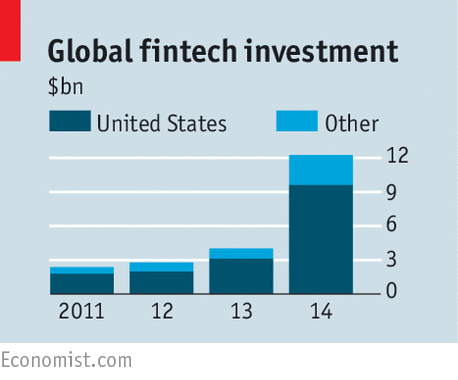

Fintech is the newest, in-vogue term making circles in the entrepreneurial sector. Despite the popularity, many still don’t have a clear handle on what this term entails. In this article, we try to demystify Fintech and all the noise around it.

## What is Fintech
Simply put, Fintech is an aggregation of terms Finance and Technology. It’s an umbrella term for all technology and [software development around financial services](/financial-software-development-company/) and products. Finance has always been considered, a somewhat difficult concept for the general masses.

Any startup that is working in the Fintech market is looking to use technology to improve the current system of transactions, payments, loans, fundraising, investments or portfolio management. This could be geared towards the general mass or could be in the B2B segment.

The rise of interest and investments in Fintech companies has been phenomenal. Accenture reported that the global investment in Fintech companies was around $930 million back in 2008 which has jumped to a massive over $12 billion in the beginning of 2015. In an sector that is heavily marred by red tape, bureaucracy and regulations, the massively growing interest only shows that there is much to be done.

## What Does Fintech Cover
Fintech being an umbrella term, covers any technological disruption related to finance. Some of the more popular categories under Fintech are:

## Lending & Financing
The business of money lending and financing has largely been owned by banking institutions and big non-banking financial institutions so far. But we are seeing a lot of disruption in this market by startups looking to make this process peer-to-peer. Prosper and Lending Club are two of the most well known startups in the lending market.

Instead of approaching banks and applying for loans, these startups have enabled people to borrow and lend money to others through their platform. Democratization of loan and transparency in operations, coupled with data-driven decisions makes for a much better experience for both the parties. And this has allowed the startups to keep interest rates lower than bank.

## Payments and E-Wallets
Digital payments, e-wallets and mobile wallets have made a huge impact on how people transact. A natural extension of digital payments, mobile wallets let users store money and credit cards on their mobile devices and transact through their phones without ever opening their actual wallet. Google’s Android pay and Apple’s Apple Pay are two of the most well known digital wallets.

Payal has been considered as one of the pioneers of the digital payments industry. Post its acquisition by eBay, Paypal payments rapidly gained popularity and became the choice of payment method for majority of eBay users. This led to a chain effect, giving rise to a whole new segment concerned with digital payments – payment gateways, security companies and fraud detection softwares etc to name a few.

## Financial Management
Startups looking to improve the way people manage their personal finances fall under the category of financial management. Apps, chatbots, websites designed to help people manage money and invest better are all part of it. Young adults and the younger generation of Millennials are in much more need to the right money management ways thanks to the rising number of loans and general financial dissatisfaction. CreditKarma, Mint and Envestnet are some of the more well known startups working towards financial management. Abe, Cleo and Plum are some of the chatbots that are working towards making banking more conversational, personal and accessible.

 

There’s a lot of excitement when it comes to Fintech. People who are closely related to the industry believe that Fintech will fundamentally change and improve finance. One very obvious improvement, that every industry disrupted by technology has seen – lowering of costs and improvement of services. Companies like Payoneer and TransferWise are already providing ways to transfer money internationally, at much lower prices.

The other improvement that we’re likely to see is better, data-driven decision making. Technology companies are able to identify better loan prospects based on algorithms driven by millions of data points. This is effectively able to overcome human bias and prejudice.

Fintech is at a very nascent stage. There is a huge opportunity for entrepreneurs, as well as companies dealing in financial sector to take advantage of. If you have any ideas around Fintech that you’d like us to help you shape up –[ drop us a line](/contact-us). We’re firm believers of technology making people’s lives easier!