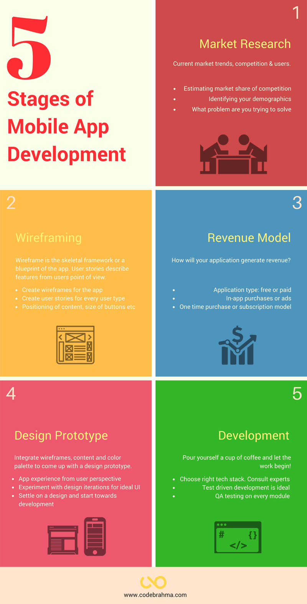

Idea, designs, business model, investor meetings, user acquisition, sales, product development…. – starting a web/mobile application business can be daunting. And if you’re getting into this for the first time, the amount of information and the work involved can be mind boggling.

Here’s the good part – we can take one thing off your plate – the application development part! Over the years, we’ve worked on a bunch of products, spoken to a lot of founders and even worked on our own products. Doing this over and again for about 5 years, we have perfected how one should go about creating applications that your users will LOVE.

This is a quick article that’ll familiarize you with all the steps that go into creating an application successfully. Feel free to drop in your thoughts at the end!

__Market Research:__ Market research is studying current trends, opinion research and data interpretation from surveys. This involves estimating current trends and studying about your potential audience. Cannot forget competition analysis – you won’t enter a battlefield without knowing who you’re up against, will you?

__Wireframe:__ It is a page schematic or blueprint of the app. It’s generally a low-fidelity mockup of app screens with placeholders for content, images and buttons. Creating user stories along with, makes the development process a lot easier. Clarity between what the client is expecting and what the agency is building is ensured.

__Revenue model:__ If you’re hiring an agency for development, chances are you’re looking to make money out of it. Deciding on how your application will make money in the initial stages makes development easier and pain free. In-app purchases, ads or making the application paid are general revenue sources. What would you prefer?

__Design prototype:__ Design prototype is how your application is going to look once it’s ready. The wireframes, color palette and the content placement is all brought together in this step. The prototype is high-fidelity, meaning it’ll resemble very closely to the shipped application. Iterate multiple times, till you’re satisfied – but know when to take a call and start development. A shipped product is better than an unfinished ‘perfect’ product.

__Development:__ This is where the active work begins on app development. The architecture of the application is created, if required, and developers begin churning out beautiful code. Front end guys begin transforming the designs into amazing pages or screens. The whole is put together, tested with every possible edge case, demoed to the client and shipped! The product is now in your hand to be used.

That’s our 5 stage process to make your app development strategy easier – simple and gets the job done! We have more than 40 clients who agree with us. 🙂

If you’re thinking of entering the mobile application market – [drop us a line](/contact). We love building great products!
