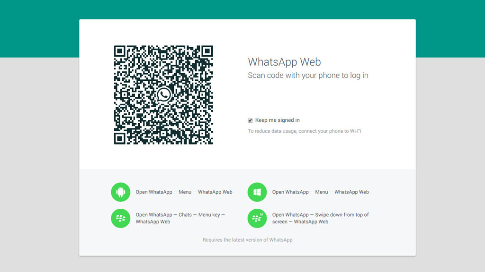

ReactJS is an open-source JavaScript library and is being maintained by Facebook developers, and it has gained exponential popularity over the 3 years since of it’s release.

React  is a component oriented abstraction and it solves the view portion of front end web development and could also be used in other mobile and web domains. With it amazing features including One way data flow, Virtual DOM and allowing Javascript Extensions (JSX).

However, it is only restricted to ‘view’ , server side rendering and easily readable code are a big plus. Taking advantage of all the things React has to offer on the front, it is widely used by many popular sites.

Reasons why React can or should be used cannot be summed up in one go. But the platforms using React might give you some idea how effective it could be.

Here is the list:

## 1. Dropbox

Dropbox is a Web-based file hosting service operated by Dropbox, Inc. that uses cloud computing to enable users to store and share files and folders with others across the Internet using file synchronization. It was founded in 2007 by Drew Houston and Arash Ferdowsi as a Y Combinator startup

## 2. Instagram

Instagram is an online mobile photo-sharing, video-sharing, and social networking service that enables its users to take pictures and videos and share them on social media sites. Just like Twitter you can use hashtags. It is well known that Instagram crossed Twitter in terms of active users in 2014.

## 3. Netflix

Netflix is an on-demand online video streaming service with 44 million subscribers worldwide.

## 4. Pinterest

Pinterest users can upload, save, sort, and manage images and videos -known as pins, through collections known as pinboards. Pinterest acts as a personalized media platform where users can browse the content of others in their feed.

## 5. Reddit

Reddit is a user generated content social networking site, where users can submit a link or post anything like question , and participate in community via threads.

## 6. Imgur

Imgur is an online image hosting and sharing platform known for viral, most popular memes and gifs.

## 7. Whatsapp (web version)

Whatsapp is a messaging service to connect with family and friends and can also be used for sharing media content. Web version syncs with the mobile device and hence, can only be accessed if the if the user is logged in and connected online.

## 8. Asana

Asana is a web and mobile application designed for teams to track their work. Tasks, projects and conversations are can be easily managed allowing teams to be more productive.

## 9. Flipboard

Flipboard is the one stop online social magazine, where content from social networks, publishers, online sources and photo sharing sites could all be accessed in one place.

## 10. Paypal

PayPal is a worldwide online payments system which allows money transfer and is an electronic alternatives to traditional paper methods.

The above are some of the most popular websites that use on React JS. It can only be attributed to ease of use, speed and platform compatibility among other things.

Let us know about your favourite website that runs on React in the comments section below!

[Oh, and if you’re looking for a React JS development team, contact us here.](/contact)
