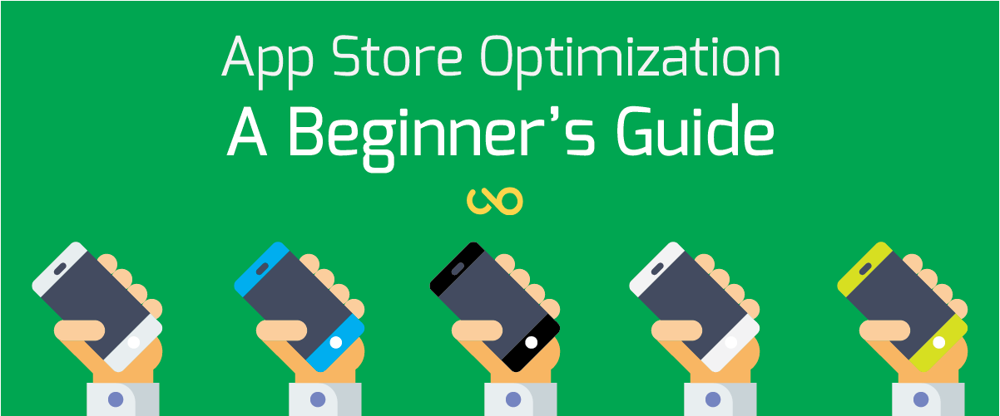
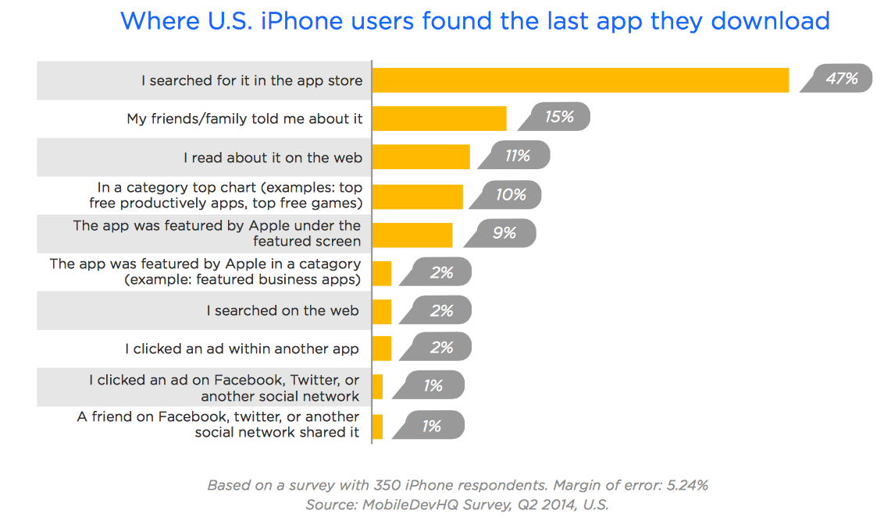
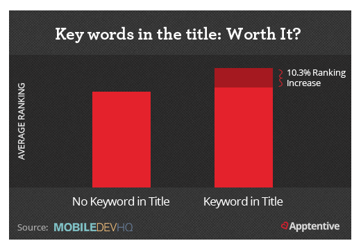
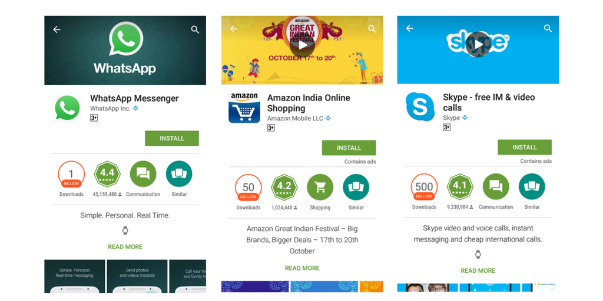
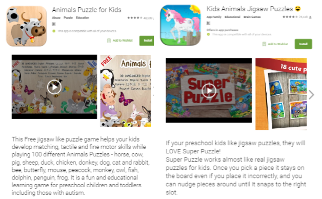

More than 2 million apps each on iOS, Android stores and thousands being added every day while a majority of the apps still remain unexplored. It was reported that nearly [60% of the apps on the App Store have __never__ been downloaded](http://appdiggity.com/60-of-app-store-apps-have-never-been-downloaded/) and the numbers have only been increasing ever since. Reason being – only ‘top and popular apps’ are being downloaded over and over, while there is little knowledge about others.

All this directs to less or no visibility of such apps and are thus, never picked up by the algorithm to show in search results. Visibility is associated to title of the app, description among other factors. For higher ranking, all of these need to be optimized accordingly and must comply to the guidelines of respective app store to get high ranking, the process known as App Store Optimisation.

## App Store Optimisation
App Store Optimization (ASO) is basically optimizing your app page in order to get better visibility when some one searches with keywords on the app store. ASO involves optimising titles, app descriptions, keywords and other important factors that are considered by the search algorithm that improve visibility.

ASO is to app store what SEO is to search engines which will result in higher search ranking and eventually lead to one thing – download of the app.

## Why is ASO necessary?
ASO is necessary for the reason that you want your app to be successful. Releasing an app on the store and just waiting for it take off is a thoughtless idea. Regardless of how great the quality of an app is, without optimisation – it will be lost in the lot and will likely to be never found by users.

There are a lot of ways users discover an app – friends, online ads, blog articles etc, but searching on the app store remains the most likely way someone will find your app. A staggering 47% of iPhone users in the US admit that they found their last installed app by searching the app store.

Highest portion of app discovery happens through keyword search and higher ranking directly impacts on the number of downloads.

## Discovery in search bar
An average user who browses on app store, the search bar is mostly used in two ways. In first case, you are looking for a particular app that you know of, and search by app name. In other cases, you don’t know what you’re looking for, i.e unaware of app(s) because they are not popular or you’ve never used before. In such situation one might go with ‘general phrases’ like puzzle games for kids or multiplayer race games  and look for results.

The algorithm captures these phrases and looks for direct results and moves on to apps that have similar keywords in app descriptions. Thus, optimising these factors can boost visibility, leading to a higher number of views on the app and increased downloads.

## App Store Optimising Factors
ASO isn’t is a single metric that can be worked overnight. It comprises of several elements including title, description, reviews etc. Depending on the importance, we’ve classified the factors into primary and secondary. You need to make sure that your primary factors are in place before you can expect any boost in the rankings.

### Primary Factors
#### Title
The title is the biggest contributing factor for search ranking. When a ‘keyword’ is searched for, apps with the keyword in the title are given utmost importance and picked up first by the app stores.

For instance – let’s take Amazon, Skype and Whatsapp. These are giants in shopping, video-call and messaging categories respectively. It’s also important to note that Skype and Amazon have 500 million downloads and Whatsapp crossing over 1 Billion. Now, let’s have a look at their app pages

Take a look at the app titles. They are not just __Amazon, Skype and Whatsapp but are ‘ Amazon shopping’ ‘ Skype – free IM & video calls’__ and __‘Whatsapp messenger’__. These titles not only show the app names but also mention their functionality – what they are meant for, and has an advantage over any other app in the category.

__Description__
Description is next crucial thing after app title. The algorithm searches the app description for relevant keywords and ranks accordingly after matching phrases. For instance – if you search for ‘ puzzle games for kids’ the results are as follows:

__Animals Puzzle for Kids__ –  This Free jigsaw like puzzle game helps your kids develop matching, tactile and fine motor skills while playing 100 different Animals Puzzles – horse, cow, pig, sheep, duck, chicken, donkey, dog, cat and rabbit, bee, butterfly, mouse, peacock, monkey, owl, fish, dolphin, penguin, frog.

__Kids Animals Jigsaw Puzzles__– If your preschool kids like jigsaw puzzles, they will LOVE Super Puzzle! Super Puzzle works almost like real jigsaw puzzles for kids. Once you pick a piece it stays on the board even if you place it incorrectly, and you can nudge pieces around until it snaps to the right slot.

In addition to title, the app descriptions have very relevant keywords and hence, have great of visibility and top ranking.

## Secondary Factors
Secondary factors may be aren’t that crucial as the above but, cannot be completely ignored either. These factors add value to primary factors in getting a good rank.

### Downloads
Higher number of downloads indicate that more number of people have used and that means it will be shown more frequently in ‘similar apps’ and ‘users also installed’ section. With increasing downloads, the app also gets increasing exposure.

### Reviews
Reviews reflect the quality of the app. All applications have an average rating on a given scale of 1 – 5 that is given by users. 5 star rating of an app indicates best quality, good user experience and everything that makes the app more likeable to download.

### Localisation
While uploading apps on the store, uploader has an option to make to available for all, or specific regions. Although an app can be searched with title and keywords globally, having a regional/country preference will give a higher ranking whenever search request comes from that geographical boundary.

### Asset Optimizing
Screenshots and promo video (if any)  placed right in the app page helps users know how the app is going to look like Decoding the functionality based on user interface, users will quickly be able to judge whether your app solves their purpose or not.

## How is Android ASO different from iOS ASO?
Although app store optimization is the process of increasing discoverability of apps, there are different guidelines to comply with, for different app stores. While, most of the factors are generalised and applicable in most cases, there are some guidelines that are different in ios and android.

### iOS App store guidelines
The most important factor that defies with normal app store optimisation rules is that, in iOS the content description doesn’t contribute to search ranking at all. However, the uploader specifies a list of keywords that relevant to the app which is taken into consideration by algorithm. The app is only searchable by app name, company name, and keywords which are given by developer during metadata setup.

_Some other guidelines include:_

100 word limit description and 50 word limit for app name
Special characters and keyword repetition are not recommended and aren’t considered by search algorithm
Every app should be mandatorily assigned one primary category, and also under optional subcategories. If the app is directed to kids under 11, it must be checked for ‘Made for Kids’.
iOS app description has no effect in the search ranking.

### Android Play Store Guidelines
Android, just like Google relies more on the semantics to improve search accuracy by understanding searcher intent and the contextual meaning of terms as they appear in the searchable dataspace. So the title, description, reviews, categories -everything is taken into account by Android for the results.

_Some other guidelines include:_

Android allows for long descriptions. Users can find application features by clicking on ‘Read More’, whereas just a single line description is shown on the app pages.
Google collects data about installs, uninstalls, install retention and app engagement. Apps that are doing well in these metrics are ranked higher.
Apps that have good number of ‘+1’ in Google plus or are shared in any kind of social media get a general rank boost

App store optimization is important, and can give the boost your app needs to get hugely popular. Have you tried using these tactics for your app? How has your experience been? We’d love to hear your thoughts in the comments section below.
