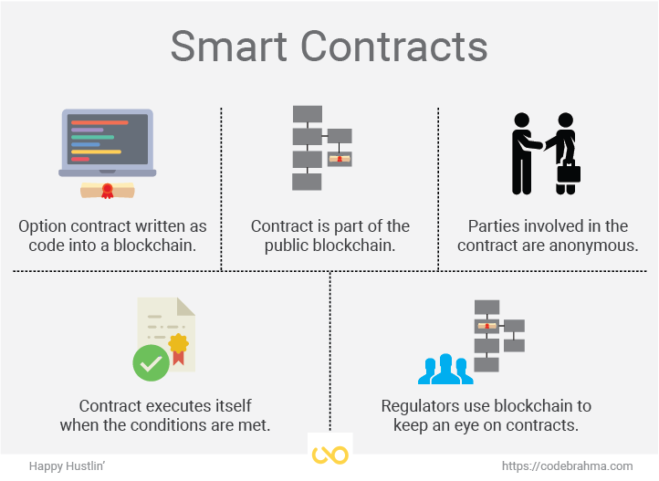

## What is a Smart Contract
A smart contract is a computer program designed to facilitate, verify and enforce an agreement. When implemented, a smart contract can very well replace the need for an attorney or a notary to sign a document which then can be upheld in the court.

These contracts execute themselves when the all the clauses in the contract are met. So, for example, if you draw up a smart contract to lease your apartment with the two conditions being rent paid and the time the key (assuming a digital key) is handed over. As soon as the renting party pays the due amount – the contract ensures the key is transferred to the tenant. The landlord cannot prevent the transfer of the key once the rent is paid – nor is the key transferred before the rent in paid. Because the contract is publicly recorded with the identities kept anonymous – neither the landlord nor the tenants can accuse of any wrong doings. The smart contract acts as a liaison ensuring the contract conditions are always met.

## How Does a Smart Contract Work
A smart contract works on the principles of blockchain – a distributed, decentralized database used as a ledger system by the Bitcoin. Think of blockchain as a ledger, replicated across thousands of computers, instead of being on one location. The updating of such distributed ledger is done by the system itself, and has rules defined to verify and ensure correctness of the data. As the ledger is public and hosted by a lot of computers all across the world – the entry (transactions) is publicly verified while the identities of the individual participants is anonymous. Replication of the document makes the information contained in it, immutable.

Smart contracts run on the blockchain technology – they are immutable and are enforced by the system itself. And because the contract is publicly verifiable – the chances of conflict are minimized. While smart contracts may appear like a solution to the overburdened justice system – they cannot be solely entrusted. Most of the lawyers working towards making smart contracts publicly available think of the future of jurisdiction as a combination of smart contracts and old school paper contracts.

## Smart Contract Applications
The concept of smart contracts can be used to run any condition driven operation. Smart contracts take out the confusion and uncertainty from an agreement, because the enforcement is also taken care of by the program. This makes the underlying concept of smart contracts applicable to whole variety of businesses and operations. From healthcare to financial services & [Fintech](/financial-software-development-company), to supply chain management and even governance – any sector that could do better with highly secure, automated actions based on certain conditions can greatly benefit from smart contracts.

### Some of the possible smart contract applications are:

__Supply Chain__ – Logistics companies can use smart contracts to update their suppliers and inventories based on deliveries. Jeff Garzik explained this in a Blockchain conference held in Washington DC last year. “If I receive cash on delivery at this location in a developing, emerging market, then this other _product_, many, many links up the supply chain, will trigger a supplier creating a new item since the existing item was just delivered in that developing market.”

__Real Estate__ – Continuing the example we used in the starting of the article, a smart contract makes real estate transactions way less stressful. The buyer and the seller draw a smart contract that’ll transfer the ownership of the property to the buyer on receiving the agreed upon amount.

__Insurance__ – Insurance policies can be partially replaced by smart contracts. Health insurance can be disbursed via a smart contract on receiving the confirmation (Proof of Work) of a surgery or health procedure. The Proof of Work itself can be based on a blockchain system wherein every patient’s record is maintained and certain authorities has a key to access the data.

__Personal Identity__ – Every individual could hold their identification proofs digitally and grant access to authorities based on need. This will greatly reduce the friction of identity management and make the process of Know Your Customer (KYC) much simpler. It’s way more secure as well.

Let’s face it, smart contracts have a long way to go before being accepted as a norm. Replacing complex processes and contracts that have been in the market for over 50 years, with standardized, enforceable contracts will take time. With the growing acceptance of blockchain and Bitcoin, we are definitely moving in the right direction.

_The possibilities are endless. Excitement is a natural by product_.

Codebrahma is an expert [Blockchain application development company](/serviceblockchain-development-company/). If you’re thinking of implementing a smart contract for your business, we’d love to talk to you about it and see if we can help!
